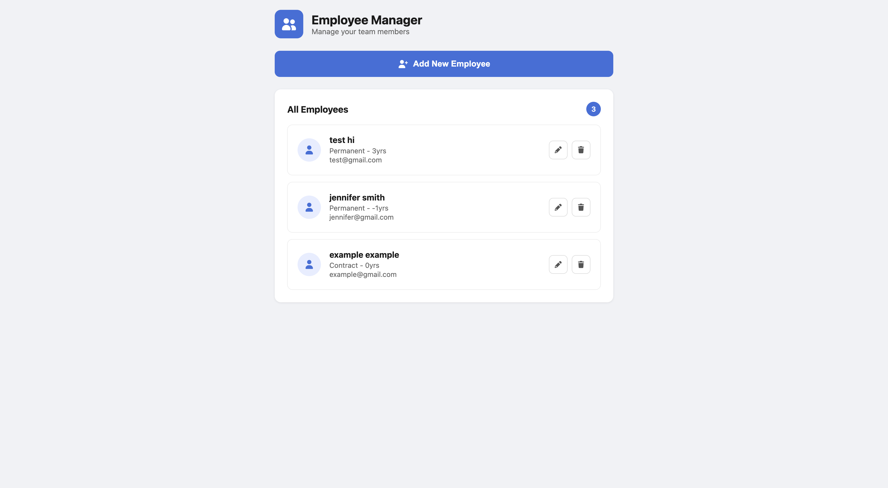
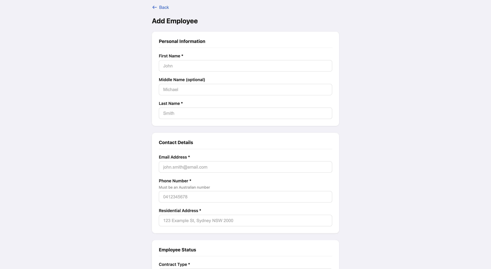
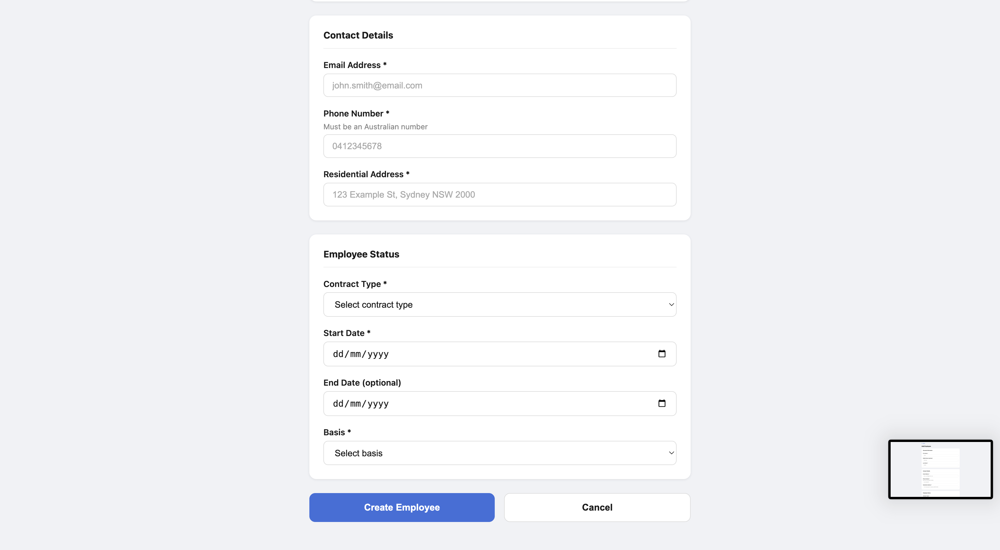

# Employee-Creator-App

## Demo & Snippets

- App runs locally at `http://localhost:5173` (frontend) and `http://localhost:8080` (backend)

**Employee List Page**


**Employee Form Page**



---

## Requirements / Purpose

### MVP
A full-stack web application that allows a company to manage their employees. Users can create, view, edit and delete employee records through a clean and intuitive interface.

### Purpose
Built as a capstone project during the _nology Full Stack Engineer Program. The goal was to demonstrate proficiency across the full stack — designing and building a RESTful API in Java with Spring Boot, connecting it to a MySQL database, and consuming it from a React TypeScript frontend with form validation and state management.

### Stack

| Layer | Technology | Why |
|-------|-----------|-----|
| Backend | Java 25 + Spring Boot 3.5 | Industry-standard Java framework with built-in dependency injection, JPA integration, and RESTful support out of the box |
| Database | MySQL 9.5 | Relational database well-suited for structured employee data with defined relationships |
| ORM | Spring Data JPA / Hibernate | Removes boilerplate SQL — maps Java classes directly to database tables and auto-generates queries |
| Frontend | React 18 + TypeScript | Component-based UI with TypeScript's type safety catching bugs at compile time rather than runtime |
| Build Tool | Vite | Fast development server with instant hot module replacement |
| Form Validation | React Hook Form + Zod | React Hook Form manages form state efficiently; Zod provides schema-based validation with TypeScript inference |
| Styling | SCSS | Nested syntax and variables make styles cleaner and more maintainable than plain CSS |
| HTTP Client | Axios | Cleaner API than the native fetch with automatic JSON parsing and better error handling |
| Routing | React Router v6 | Declarative client-side routing for navigating between list and form pages |

---

## Build Steps

### Prerequisites
- Java 17+ (project uses Java 25)
- Node.js 18+ and npm
- MySQL 8+
- Maven

### 1. Database Setup
```sql
CREATE DATABASE employees_db;
```

### 2. Backend Setup
```bash
cd backend
# Update src/main/resources/application.properties with your MySQL credentials
mvn spring-boot:run
```

The backend will start on `http://localhost:8080`. Spring JPA will automatically create the `employees` table on first run.

### 3. Frontend Setup
```bash
cd frontend
npm install
npm run dev
```

The frontend will start on `http://localhost:5173`.

### application.properties configuration
```properties
spring.datasource.url=jdbc:mysql://localhost:3306/employees_db?createDatabaseIfNotExist=true&useSSL=false&allowPublicKeyRetrieval=true
spring.datasource.username=root
spring.datasource.password=
spring.jpa.hibernate.ddl-auto=update
server.port=8080
```

---

## Design Goals / Approach

### Layered Backend Architecture
The backend follows a three-layer architecture — Controller → Service → Repository — which separates concerns cleanly. The controller handles HTTP requests, the service contains business logic, and the repository handles database access. This makes each layer independently testable and easier to maintain.

### Type Safety Across the Stack
TypeScript was chosen for the frontend to mirror the strong typing of Java on the backend. The `Employee` interface in TypeScript directly maps to the `Employee` entity in Java, meaning type mismatches between frontend and backend are caught early.

### Schema-Based Validation
Zod was used to define a validation schema that TypeScript can infer types from directly. This means the form data type (`EmployeeFormData`) and the validation rules live in one place — if the schema changes, the types update automatically.

### Single Form for Create and Edit
Rather than building two separate form pages, a single `EmployeeFormPage` handles both create and edit modes. It detects which mode it's in by checking for an `id` parameter in the URL (`useParams`). In edit mode, it pre-fills the form using React Hook Form's `reset()` function.

---

## Features

- View all employees in a clean card-based list
- Add a new employee via a validated form
- Edit an existing employee with pre-filled form fields
- Delete an employee with confirmation via toast notification
- Form validation on all fields including Australian phone number format regex, email format, date logic (end date must be after start date), and max character limits
- Hours per week field conditionally appears only when Part Time basis is selected
- Duplicate email detection with user-facing error toast
- Custom exception handling returns appropriate HTTP status codes (404, 409, 500)
- Responsive layout with SCSS styling

---

## Known Issues

- No confirmation dialog before deleting an employee — deletion is immediate
- The `hoursPerWeek` field uses `as any` type casting due to a type mismatch between the Zod schema and React Hook Form's resolver — functionally correct but not fully type-safe
- No pagination on the employee list — all employees load at once
- No authentication or authorisation — the API is publicly accessible

---

## Future Goals

- Add a confirmation modal before deleting an employee
- Add pagination or infinite scroll to the employee list
- Add search and filter functionality to the list page
- Add JWT authentication to protect the API
- Write unit tests for the backend service layer using JUnit and Mockito
- Write frontend component tests using Vitest and React Testing Library
- Add a DTO (Data Transfer Object) layer to the backend to decouple the API contract from the database entity
- Deploy the application — backend to Railway or Render, frontend to Vercel

---

## Change Logs

### February 2026 — Backend Foundation
Set up the Spring Boot project with MySQL integration. Created the `Employee` entity with JPA annotations, built the repository layer using Spring Data JPA, implemented the service layer with business logic including duplicate email validation, and created the REST controller with full CRUD endpoints. Added CORS configuration and global exception handling returning appropriate HTTP status codes.

### February 2026 — Frontend Foundation
Initialised the React TypeScript project with Vite. Set up React Router with three routes (list, create, edit). Built the `EmployeeListPage` with `useEffect` for data fetching and `useState` for local state. Extracted the `EmployeeCard` component for cleaner separation of concerns. Built the `EmployeeFormPage` with React Hook Form and Zod validation handling both create and edit modes from a single component.

### March 2026 — Styling & Polish
Applied SCSS styling to both pages. Added Font Awesome icons for the header, edit (pencil), and delete (trash) buttons. Integrated `react-hot-toast` for success and error notifications. Fixed the `hoursPerWeek` input using `valueAsNumber` to correctly pass numeric values to the Zod schema.

---

## What Did You Struggle With?

**TypeScript type mismatches between Zod and React Hook Form**
The `hoursPerWeek` field caused persistent TypeScript errors because Zod's `coerce.number()` was inferred as `unknown` rather than `number | undefined`, which React Hook Form's resolver couldn't accept. This was resolved by falling back to `z.number().optional()` combined with `valueAsNumber: true` on the input, and using `as any` on the resolver as a pragmatic workaround.

**CORS configuration**
Early API calls from the frontend failed silently because the backend was blocking requests from a different origin (port 5173 vs 8080). Understanding why the browser was blocking the requests and then configuring a `WebMvcConfigurer` bean in Spring to explicitly allow the frontend origin resolved the issue.

**Java Optional imports**
An early bug was caused by importing `Optional` from Google Guava instead of `java.util`. The methods had slightly different signatures which caused runtime errors that were difficult to trace back to the import statement.

---

## Licensing Details

This project is released under the MIT License.

---

## Further Details

Built as part of the _nology Full Stack Engineer Program (2026). This is an original project built from scratch following the program brief.
